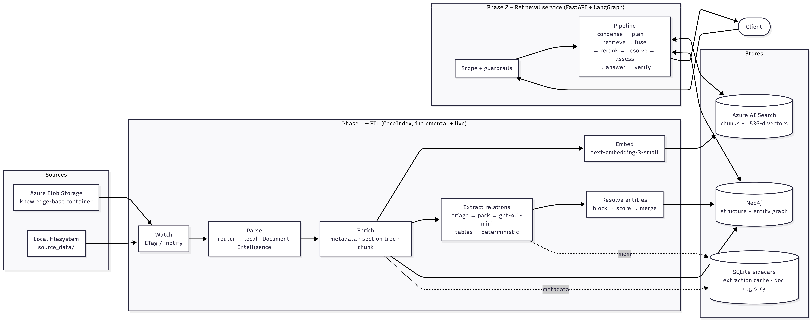

# Azure RAG ETL

A production-shaped **ETL + RAG system built on Azure AI Services**. Point it at
a folder or a blob container, and it keeps a vector index and a knowledge graph
in sync with your documents — then answers questions from both, with citations,
version awareness, department-level access control, and an explicit refusal when
your documents do not contain the answer.

Clone it, add your Azure credentials, drop in your own documents, and it runs.

```
Documents ─► Parse ─► Chunk ─► Embed ─────────────► Azure AI Search
   (live)      │        │                                  │
               │        └─► Triage ─► Extract ─► Resolve ─► Neo4j
               │                                            │
               └──────────────────────────────────────┐     │
                                                      ▼     ▼
  Question ─► Condense ─► Plan ─► Retrieve (vector + graph) ─► Fuse
           ─► Rerank ─► Resolve versions ─► Assess ─► Answer ─► Verify ─► Reply
```

---

## What it does

- **Ingests almost anything.** PDF (including scanned, via OCR), DOCX, XLSX, PPTX, CSV, TSV, TXT, Markdown, HTML, JSON, images. A file it cannot parse is recorded and skipped — one bad document never stops a run.
- **Stays in sync.** Incremental and content-fingerprinted: an unchanged file costs nothing, a changed one reprocesses, and a **deleted one is removed from the vector index *and* the graph**, including entities left without provenance.
- **Builds a real knowledge graph.** Not just document structure — LLM-extracted entities and typed relations, every edge carrying the chunk, page and evidence span it came from. Tables are extracted deterministically and never reach a model.
- **Extraction that scales.** Triage, section-level units, packing, a content-hash cache and a cache-friendly prompt prefix take a corpus from 109 naive LLM calls down to 2. Re-ingesting unchanged documents costs **$0.00**.
- **Answers are grounded.** A sufficiency gate before generation and claim-level verification after it, plus numeric citations that can be checked mechanically rather than eyeballed.
- **It refuses.** When your documents do not answer a question, it says so and names the closest documents instead of inventing something.
- **Departments are configuration.** One environment variable drives what is monitored, ingested, labelled and retrievable — and who is allowed to see it.

### Measured against a naive baseline

51 questions, live Azure services, same corpus and same judge on both sides
([`EVALUATION.md`](docs/EVALUATION.md)):

| | Baseline RAG | This system |
|---|---|---|
| **Hallucination rate** | 3.9% | **0.0%** |
| **Behaviour accuracy** | 86.3% | **100.0%** |
| Answer correctness | 88.7% | **98.5%** |
| Citation accuracy | 94.6% | **97.8%** |
| MRR | 94.1% | **1.000** |
| Answered when it should not have | 6 | **0** |
| Refused when it should have answered | 1 | **0** |
| Latency p50 / p95 | 3.8s / 17.4s | 9.0s / **15.4s** |
| Cost per query | $0.0013 | $0.0025 |

Roughly 2.4× the median latency and 1.9× the cost, spent on eliminating
confident wrong answers — and *faster* in the tail, because the baseline's worst
cases are the ones where it retrieves weakly and generates a long speculative
answer anyway.

---

## Quickstart

### 1. Azure resources

| Service | Used for | Required |
|---|---|---|
| **Azure OpenAI** | A chat deployment (e.g. `gpt-4.1-mini`) and an embedding deployment (`text-embedding-3-small`) | Yes |
| **Azure AI Search** | Hybrid search, RRF fusion and semantic reranking. Enable the **semantic ranker** on the service | Yes |
| **Neo4j** | The knowledge graph. Aura, Docker, or anything speaking Bolt | Yes — or set `GRAPH_ENABLED=false` to run vector-only |
| **Azure AI Document Intelligence** | OCR for scanned PDFs and images | Only if your documents include them |

### 2. Install and configure

```bash
git clone https://github.com/elt7613/Azure-Rag-ETL.git && cd Azure-Rag-ETL
python -m venv .venv && source .venv/bin/activate     # or conda
pip install -e ".[dev]"

cp .env.example .env
```

Open `.env` and fill in the values marked `REQUIRED` — the Azure OpenAI
endpoint and key, the embedding deployment name, and the Azure AI Search
endpoint, key and index name. Every setting is documented inline in that file;
nothing else is mandatory to start.

### 3. Ingest and ask

```bash
# One pass over source_data/ — creates the index, embeds, builds the graph
cocoindex --app-dir . update rag.etl.app

# Serve
uvicorn rag.api.main:app --reload
```

Open <http://localhost:8000> and ask *"How many days of paid sick leave do
employees get?"*

Or from the shell:

```bash
curl -s localhost:8000/chat \
  -H 'Content-Type: application/json' \
  -H 'X-User-Departments: HR,finance,IT,legal,sales' \
  -d '{"message":"What is the current Enterprise tier price per seat?"}' | jq
```

### 4. Watch for changes

```bash
cocoindex --app-dir . update rag.etl.app --live
```

Add, edit or delete a file under `source_data/` and the index and graph follow
it, including the delete.

---

## Using your own documents

**Replace the corpus.** Point `LOCAL_SOURCE_DIR` at your folder, one subfolder
per department:

```
my_documents/
  engineering/   runbook.pdf  architecture.md
  legal/         nda.docx     msa.pdf
  support/       faq.html     escalation-matrix.xlsx
```

**Declare the departments.** They must match the folder names — matching is
case-insensitive, and `DEPARTMENT_SOURCES` maps a department to a differently
named folder if you need it:

```bash
LOCAL_SOURCE_DIR=my_documents
DEPARTMENTS=["engineering","legal","support"]
```

**Re-ingest.**

```bash
cocoindex --app-dir . update rag.etl.app
```

That is the whole change. Adding a fourth department later is one more entry in
`DEPARTMENTS` plus a folder — no code.

> **After changing parsing, chunking or the ontology**, force a rebuild:
> `cocoindex --app-dir . update rag.etl.app --full-reprocess -f`.
> Reprocessing is keyed on document *content*, so a code change alone leaves the
> stores serving output from the previous version.

### Reading from Azure Blob Storage instead

```bash
DOC_SOURCE=blob
AZURE_STORAGE_ACCOUNT=...
AZURE_STORAGE_CONTAINER=knowledge-base
AZURE_STORAGE_KEY=...
```

Blob prefixes take the place of folders. Changes are detected by ETag, so
polling costs nothing until something actually changes.

### Documents with a metadata header

The pipeline reads an optional pipe-delimited first line for version and date
metadata. It is not required, but it is what powers version resolution:

```
Contoso Ltd. | Sales Operations | Effective: January 1, 2026 | Version 2.0 | Supersedes: 2025 Rate Card (v1.0)
```

Given that, a question about pricing answers from the current rate card, says
which version it used, and keeps the superseded one retrievable — because it
still governs contracts signed while it was in force.

---

## Configuration

Everything lives in `.env`, and every field is documented there. `.env.example`
and `.env` are both generated from the settings class, so they cannot drift:

```bash
python scripts/gen_env.py            # regenerate after adding a setting
python scripts/gen_env.py --check    # verify they are current (used by a test)
```

The settings worth knowing about early:

| Setting | Default | Why you might change it |
|---|---|---|
| `DEPARTMENTS` | `["HR","finance","IT","legal","sales"]` | Must match your folder names |
| `LOCAL_SOURCE_DIR` | `source_data` | Your document folder |
| `API_DEFAULT_DEPARTMENTS` | `[]` | **Empty denies everything.** Set it for a single-tenant deployment; leave it empty behind a real auth gateway |
| `GRAPH_ENABLED` | `true` | `false` runs vector-only, no Neo4j needed |
| `GRAPH_EXTRACTION_ENABLED` | `true` | `false` keeps the structural graph but skips LLM extraction |
| `DOC_PARSER` | `auto` | `local` never calls Document Intelligence |
| `SUFFICIENCY_THRESHOLD` | `1.6` | Raise to refuse more readily, lower to answer more readily |
| `RETRIEVAL_TOP_K` | `8` | Chunks passed to the answer prompt |

---

## API

| Endpoint | Purpose |
|---|---|
| `GET /` | Chat page |
| `POST /chat` | Question in; grounded answer, citations, confidence and diagnostics out |
| `POST /chat/stream` | Same, with progress events over SSE |
| `GET /health` | Liveness plus a real probe of every dependency |
| `GET /stats` | Queries, abstentions, p50/p95 latency, cache hit rate |
| `GET /departments` | The configured department list |
| `GET /docs` | OpenAPI |

**Access control denies by default.** A request that establishes no department
scope retrieves nothing and gets a 403 explaining why. The scope arrives in the
`X-User-Departments` header — set by your auth gateway from the caller's group
membership in production — and the request body can only *narrow* what that
header granted, never widen it.

---

## Deploying with Docker

Two long-running processes, two services: the API server (`Dockerfile.api`) and
the ETL watcher (`Dockerfile.etl`). They are the same code built from one
context with different entry points, so every build layer is cache-shared and
the second image costs nothing after the first. They must never be built from
different code, though — if the retrieval side and the ingestion side drift
onto different versions of the parsing and chunking code, answers would start
citing chunks that no longer exist.

```bash
cp .env.example .env        # fill in the REQUIRED values
docker compose up --build
```

`http://localhost:8000` is the chat page. `docker compose logs -f etl` shows the
watcher; add a document to your blob container and it appears in both stores
without a restart.

**Use blob storage, not a local folder.** A container cannot see the folder on
your laptop, so a deployed system needs `DOC_SOURCE=blob`. Changes are detected
by ETag, which means the watcher costs one cheap list call per interval and
nothing else until something actually changes.

**The `data/` volume is worth keeping.** It holds CocoIndex's incremental
ledger, the extraction cache and the document registry. Losing it loses no
documents, but the next run re-extracts and re-embeds the entire corpus — that
is billable work and slow. `docker-compose.yml` puts it on a named volume for
this reason. If you bind-mount a host directory instead, run the container as
your own uid (`--user $(id -u):$(id -g)`) or the writes will fail: the image
runs as an unprivileged user that does not own your directory.

### On Dokploy or any other Docker host

Deploy the repository as a Compose application. Delete the two `env_file`
entries from `docker-compose.yml` and set the same variables in the platform's
environment panel — the container reads real environment variables in
preference to any file, so no `.env` needs to exist inside the image. Expose
port `8000` from the `api` service and point your domain at it.

The two services must stay on one host. They share the `data/` volume, and
SQLite and LMDB over a network filesystem is a corruption bug waiting for a busy
day. `docs/PRODUCTION.md` covers what changes when you need more than one host —
the short version is that those sidecars move to Postgres.

---

## Evaluating your own corpus

```bash
python -m eval.runner --mode both --concurrency 1
```

`eval/dataset.jsonl` is an example written against `source_data/`. Replace it
with questions about your documents — the format, the metrics and how to write a
set that measures something are in [`eval/README.md`](eval/README.md).

---

## Architecture



| | |
|---|---|
| [ETL flow](docs/diagrams/ETL-Flow.png) | Watch → parse → chunk → embed → extract → write, plus deletion and version reconciliation |
| [Retrieval flow](docs/diagrams/Retrieval-Flow.png) | Condense → plan → retrieve → fuse → rerank → resolve → assess → answer → verify |

| Document | Contents |
|---|---|
| [`ARCHITECTURE.md`](docs/ARCHITECTURE.md) | Both subsystems in detail, the data model, and the production deployment topology |
| [`AZURE_SERVICES.md`](docs/AZURE_SERVICES.md) | Every service and *why*, including what was considered and rejected |
| [`EXTRACTION.md`](docs/EXTRACTION.md) | Document and relationship extraction, with the full cost model |
| [`FAILURE_SCENARIOS.md`](docs/FAILURE_SCENARIOS.md) | Six ways RAG fails, what was built for each, and live transcripts |
| [`EVALUATION.md`](docs/EVALUATION.md) | Golden set, metrics, baseline vs improved |
| [`ARCHITECTURE_QA.md`](docs/ARCHITECTURE_QA.md) | Debugging retrieval quality, latency, scale, security and cost |
| [`PRODUCTION.md`](docs/PRODUCTION.md) | What I would change first, and the known limitations |
| [`DECISIONS.md`](docs/DECISIONS.md) | Every significant decision and its reasoning — including the ones I changed |

---

## Layout

```
src/rag/
  config.py        every setting; nothing else reads the environment
  departments.py   the department registry — one source of truth for scope
  parsing/         format router, local parsers, Document Intelligence
  enrich/          metadata, section tree, chunker
  embedding/       batched Azure OpenAI embeddings
  extraction/      ontology · triage · units · cache · llm · tabular · resolve · batch
  targets/         azure_search · graph · version_sync
  sources/         live Azure Blob source with ETag change detection
  etl/app.py       the CocoIndex dataflow
  retrieval/       searcher · graph_retriever · fusion · conflict · sufficiency · cache
  agents/          condense · planner · answerer · verifier · graph_app (LangGraph)
  api/             FastAPI service, routes, security, chat page
  observability/   token and cost accounting, OpenTelemetry tracing
eval/              golden set, metrics, runner
source_data/       eleven fictional policy documents across five departments
scripts/           env generation, index setup
tests/             unit, live-integration and end-to-end
Dockerfile.api     API server image (uvicorn)
Dockerfile.etl     ETL watcher image (cocoindex update --live)
docker-compose.yml both services plus the data volume
```

---

## Tests

```bash
python -m pytest -q
```

Tests that claim to hit Azure genuinely do — they are gated on credentials
rather than mocked, because a mocked model only proves the code calls it. They
skip cleanly when credentials are absent.

The parsing and retrieval suites assert real figures from `source_data/`, so
they pass on a clone. Point the pipeline at your own documents and the offline
ones skip themselves; the live ones read their expected answers from whichever
corpus the index actually holds, and skip when it holds yours.

---

## Limitations

Worth knowing before you rely on it — the full list is in
[`PRODUCTION.md`](docs/PRODUCTION.md):

- **State is SQLite sidecars.** The extraction cache, document registry and conversation checkpoints are local files: correct for one process, wrong for two. Postgres is the documented migration.
- **Identity comes from a header.** Enforcement is sound — deny by default, narrowing only, filtered inside the query — but the input is trusted, which is fine behind a gateway and not without one.
- **The query cache is in-process.** It needs Redis before a second replica.
- **Batch extraction is unverified end to end.** The code path exists and the request shape is accepted, but it needs a `globalbatch`/`datazonebatch` deployment with enough enqueued-token quota; the 50% saving is a projection.
- **No PII detection.** A corpus containing personal data wants Presidio or Azure AI Content Safety in the ingest path.
- **Single region, no load test.**

---

## License

MIT — see [`LICENSE`](LICENSE).
