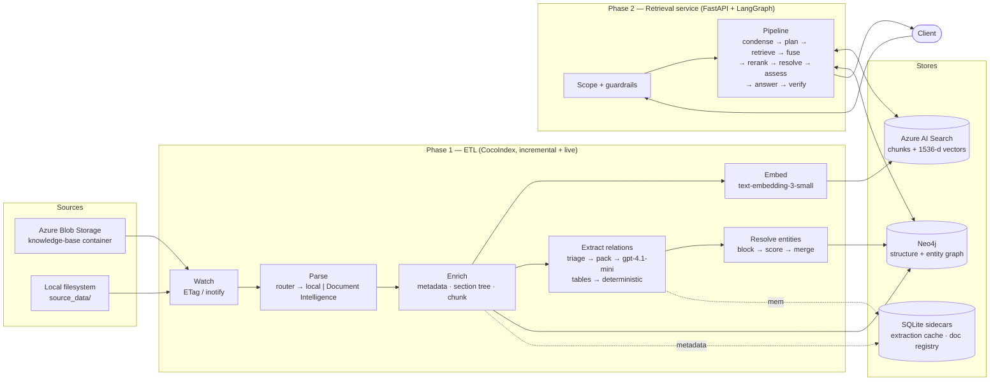
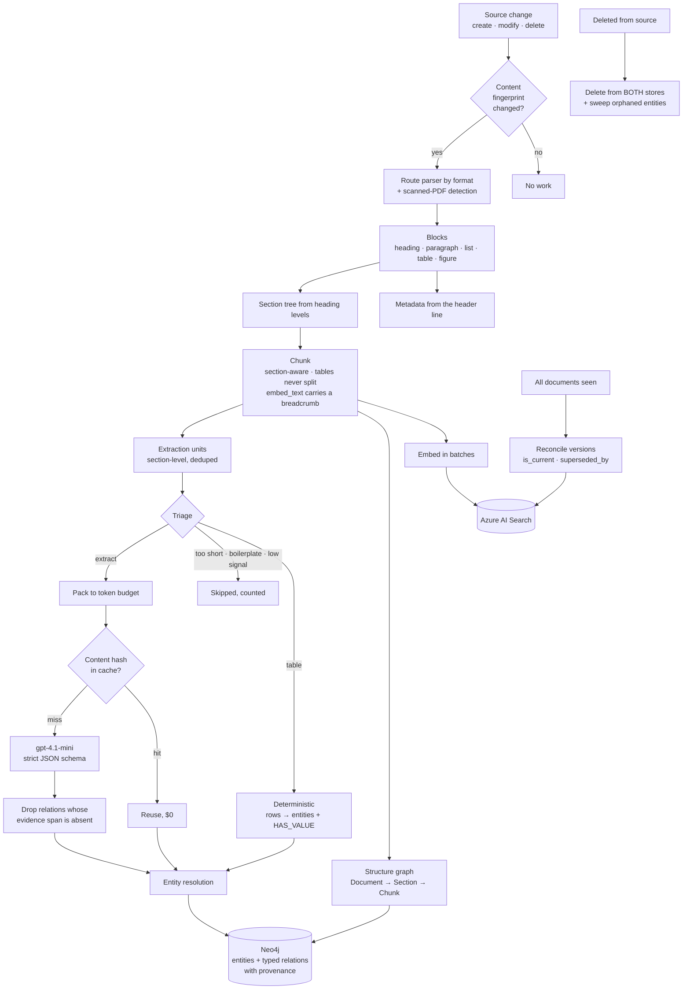
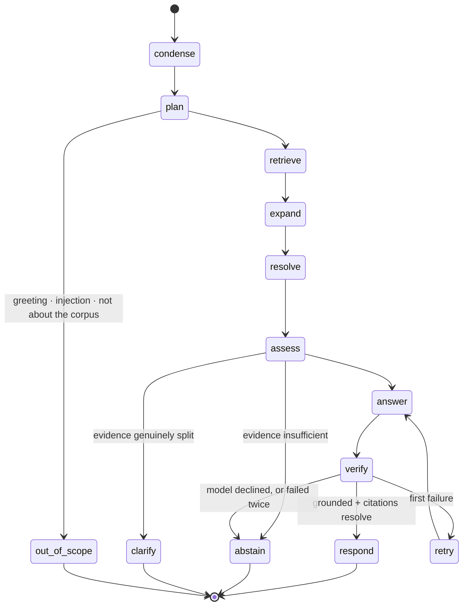
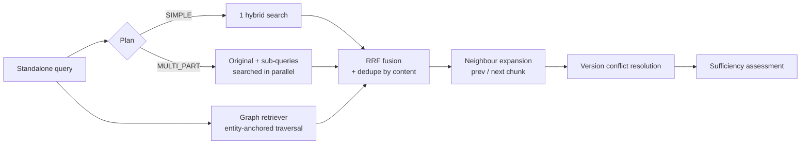
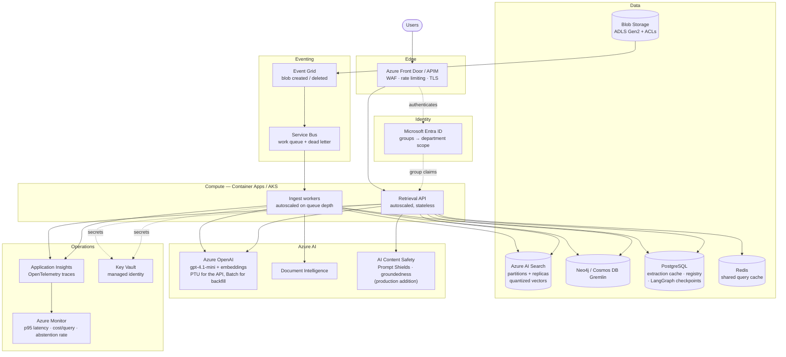
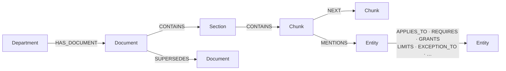

# Architecture

Two subsystems that share nothing but the stores between them: an **ETL
pipeline** that keeps Azure AI Search and Neo4j in sync with a live document
source, and a **retrieval service** that answers questions from them. Keeping
them decoupled is what lets the ingest run continuously while the API is
redeployed, and what lets the evaluation harness drive the retrieval pipeline
directly without going through HTTP.

> The diagrams below are Mermaid, so they render inline on GitHub. The same
> three are exported as PNGs in [`diagrams/`](diagrams/) for use outside it:
> [Architecture](diagrams/Architecture.png) ·
> [ETL flow](diagrams/ETL-Flow.png) ·
> [Retrieval flow](diagrams/Retrieval-Flow.png).

---

## 1. System overview

---

## 2. Phase 1 — ETL

### 2.1 Flow

### 2.2 Why each stage looks the way it does

**Watching.** `localfs.walk_dir(live=True)` uses inotify; the Blob source polls
ETags. Both feed the same memoized `process_document`, so a touched-but-unchanged
file is a no-op and only genuine content changes cost anything.

**Parsing.** A router, not a suffix switch. Local parsers handle what they
handle well; a PDF whose extractable character density falls below a threshold
is scanned, and goes to Azure Document Intelligence for OCR. Every parser emits
the same `Block` vocabulary, so everything downstream is format-blind.

**Chunking.** Section-aware rather than a fixed token window, so a rule is not
cut in half. Tables are never split. Each chunk carries two texts on purpose:
`embed_text` is breadcrumb-prefixed with the document, department, version and
section — so the vector knows *where* it is — while `display_text` is clean, and
is what reaches the answer prompt and the citation. Conflating them degrades
both retrieval and answers.

**Extraction.** The subject of its own document: see
[`EXTRACTION.md`](EXTRACTION.md).

**Reconciliation.** Two passes that cannot be done per-document, because both
are facts about the corpus rather than about one file: deletions (what
disappeared since last run) and supersession (which document replaced which).

**A memoization gotcha worth knowing.** Reprocessing is keyed on *document
content*. That is exactly right for the steady state and wrong after a code
change: fixing the parser does not make any document look different, so nothing
is reprocessed and the stores keep serving output from the previous version.
This was observed directly here — the DOCX table fix landed while the index
still held tables filed under the wrong section. After changing parsing,
chunking or the ontology, force it: `cocoindex update rag.etl.app
--full-reprocess`. At corpus scale this is the argument for stamping a pipeline
version onto every chunk and putting it in the cache key, so a change
invalidates exactly what it affects.

### 2.3 Failure behaviour

One bad document must not stop a five-million-document run. Every per-document
failure is captured as an `IngestError` with its stage, logged, counted, and
skipped; `INGEST_STATS` exposes the counters. A retriever or store being briefly
unavailable degrades that document, not the pass.

---

## 3. Phase 2 — Retrieval

### 3.1 The pipeline as a state machine

Branching is the point. A simple lookup — most traffic — costs one search, one
generation and one verification. Decomposition, graph traversal and the
corrective retry are paid for only when the question earns them.

### 3.2 Retrieval fan-out

Reciprocal Rank Fusion rather than score averaging, because the lists being
merged are on incomparable scales — the reranker gives 0–4, BM25 is unbounded,
the graph scores by path. RRF reads positions only. A chunk found by two
independent retrievers accumulates score from both, which is the cheapest
reliable relevance signal available without another model call.

### 3.3 Where each failure scenario is handled

| Scenario | Stage |
|---|---|
| Correct document, wrong chunk | hybrid + rerank + breadcrumb embeddings + neighbour expansion |
| Information across sections | `plan` decomposition + graph traversal + RRF fusion |
| Conflicting versions | `resolve` — rank current first, disclose which governs |
| Hallucination / no answer | `assess` before generation, `verify` after |
| Ambiguous query | `clarify`, but only when the evidence genuinely competes |
| Conversational context | `condense` — only the resolved query reaches the retrievers |

Detail and evidence: [`FAILURE_SCENARIOS.md`](FAILURE_SCENARIOS.md).

---

## 4. Production deployment

What is built here runs against live Azure services from a single process. This
is how it should be deployed for an enterprise, and what changes at each step.

### What changes from this build to that deployment

| Concern | Here | Production |
|---|---|---|
| Ingest trigger | inotify / ETag polling in-process | Event Grid → Service Bus → autoscaled workers |
| Ingest failure | Logged and counted | Dead-letter queue, replay, alert on rate |
| Identity | `X-User-Departments` header | Entra ID group claims injected by the gateway; header not client-settable |
| Document ACLs | Department filter | ADLS Gen2 ACLs mirrored into the index, enforced with `x-ms-query-source-authorization` |
| Sidecar state | SQLite files | PostgreSQL, so workers share it |
| Query cache | In-process | Redis, still partitioned by scope in the key |
| Conversation state | In-memory checkpointer | Postgres checkpointer |
| Secrets | `.env` | Key Vault via managed identity — no keys in config at all |
| Model capacity | Pay-as-you-go | PTU for the interactive path (predictable latency), Batch for backfill (50% off) |
| Observability | `/stats` + logs | OpenTelemetry → Application Insights, alerting on p95 latency, cost per query, abstention rate and hallucination rate |
| Index | 1 partition, 1 replica | Partitions for vector quota, replicas for QPS and availability, quantized vectors |

---

## 5. Module map

| Module | Responsibility |
|---|---|
| `rag.config` | Every setting. Nothing else reads the environment. |
| `rag.departments` | The department registry — one source of truth for scope |
| `rag.parsing` | `router` (format + scanned detection), `local_parser`, `azure_docint`, `plain`, `pptx` |
| `rag.enrich` | `metadata`, `structure` (section tree), `chunker` |
| `rag.embedding` | Batched Azure OpenAI embeddings |
| `rag.extraction` | `ontology`, `triage`, `units`, `cache`, `llm`, `tabular`, `resolve`, `batch` |
| `rag.targets` | `azure_search`, `graph`, `version_sync` |
| `rag.sources` | Live Azure Blob source with ETag change detection |
| `rag.etl.app` | The CocoIndex dataflow tying it together |
| `rag.retrieval` | `searcher`, `graph_retriever`, `fusion`, `conflict`, `sufficiency`, `cache` |
| `rag.agents` | `condense`, `planner`, `answerer`, `verifier`, `graph_app` (LangGraph) |
| `rag.api` | FastAPI app, routes, schemas, security |
| `rag.observability` | Cost and token accounting |
| `eval` | Golden set, metrics, runner, report |

---

## 6. Data model

### Azure AI Search — one document per chunk

`chunk_id` (key) · `doc_id` · `title` · `department` · `section_path` ·
`section_number` · `version` · `effective_from` · `effective_to` ·
`is_current` · `superseded_by` · `content_type` · `page` · `prev_chunk_id` ·
`next_chunk_id` · `content` · `content_vector` (1536-d, HNSW)

`department`, `doc_id`, `is_current` and `content_type` are filterable — those
are the fields access control and version resolution act on, and a filter must
be executable in the query rather than applied to the results.

### Neo4j — two layers

Layer A (Department/Document/Section/Chunk, CONTAINS/NEXT/SUPERSEDES) is
derived deterministically from parsing and cannot hallucinate. Layer B (Entity
and typed relations) is extracted, and every edge carries `doc_id`,
`source_chunk_id`, `section_path`, `page`, `department`, `confidence`,
`evidence_span` and `deterministic`. **No edge exists without a resolvable
source chunk** — that is what makes a graph-derived answer as auditable as a
vector-derived one.
